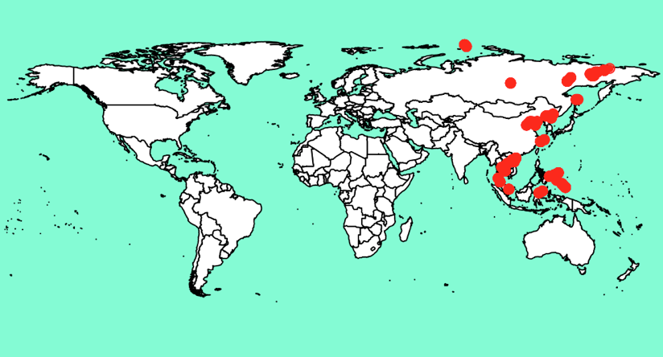
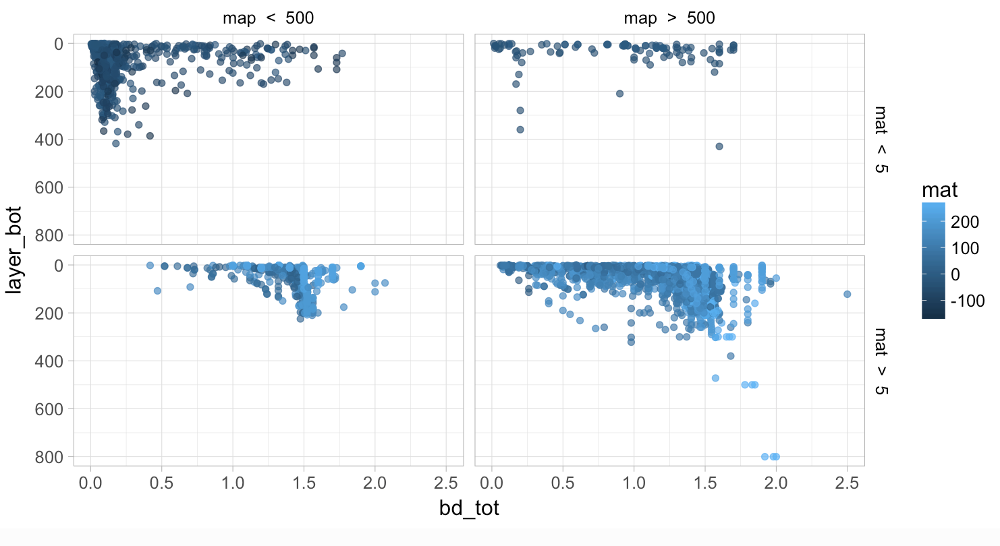
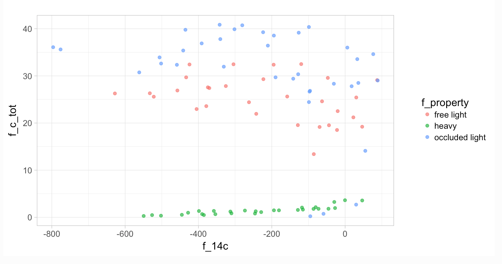

## Database template
[Template file](https://github.com/powellcenter-soilcarbon/soilcarbon/raw/master/inst/extdata/Master_template.xlsx) (Variables with red column names are required)  
[Template instructions](/site_files/Template_info.html)

## Add data!

1. Install latest version of R [https://www.r-project.org/](https://www.r-project.org/)
2. Install and load soilcarbon package (run this in R). Installing the package this way may not have have the most updated features of the package.
```{r}
install.packages("soilcarbon")
```
2. (Alternate) To  install the most recent development version of the package run this line instead.
```{r}
devtools::install_github("powellcenter-soilcarbon/soilcarbon”)
```
3. Run soilcarbon shiny workbench in R
```{r}
library(soilcarbon)
soilcarbon.shiny()
```
4. Click 'Browse' and chose the data file (Template file that you have filled with data) 
5. Click 'download quality control report' 
6. Look at the text file that is downloaded. Warning messages will describe any problems in the data file.
7. If your data passes the check, email it to powellcenter.soilcarbon@gmail.com.

### Current data

[Current datsets and doi numbers](/site_files/make_current_dataset_list.html) 








## Contribute to soilcarbon package
[Instructions for making pull requests](pull-requests).
