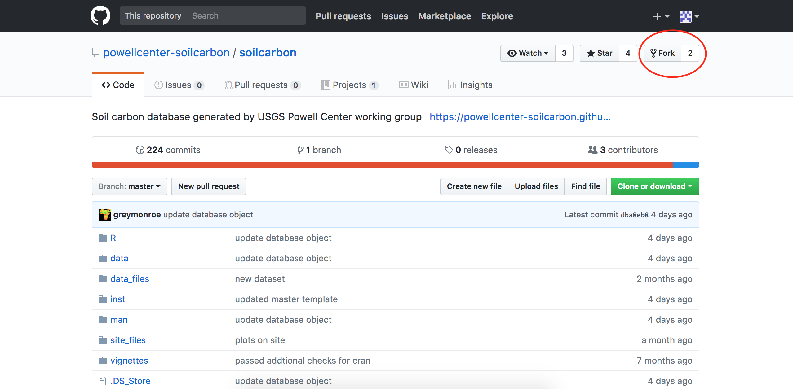
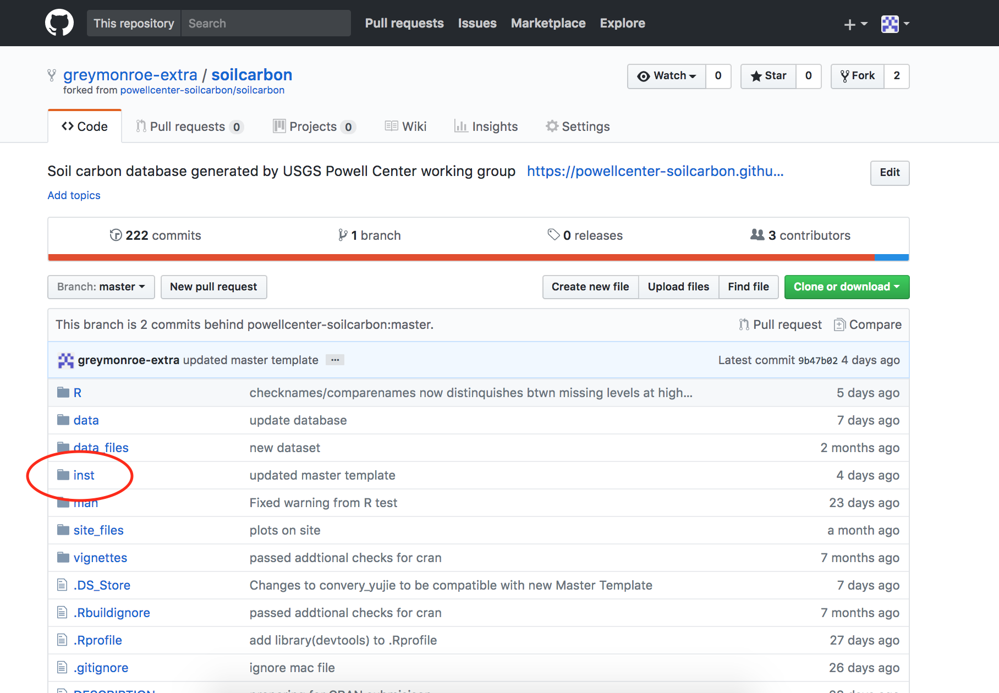
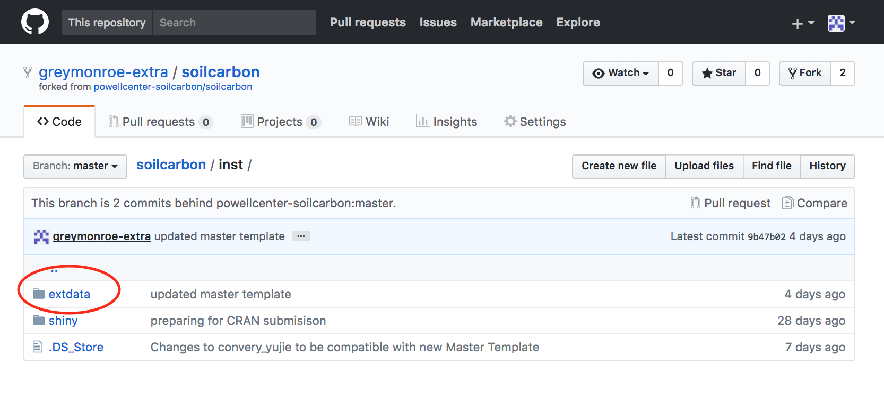
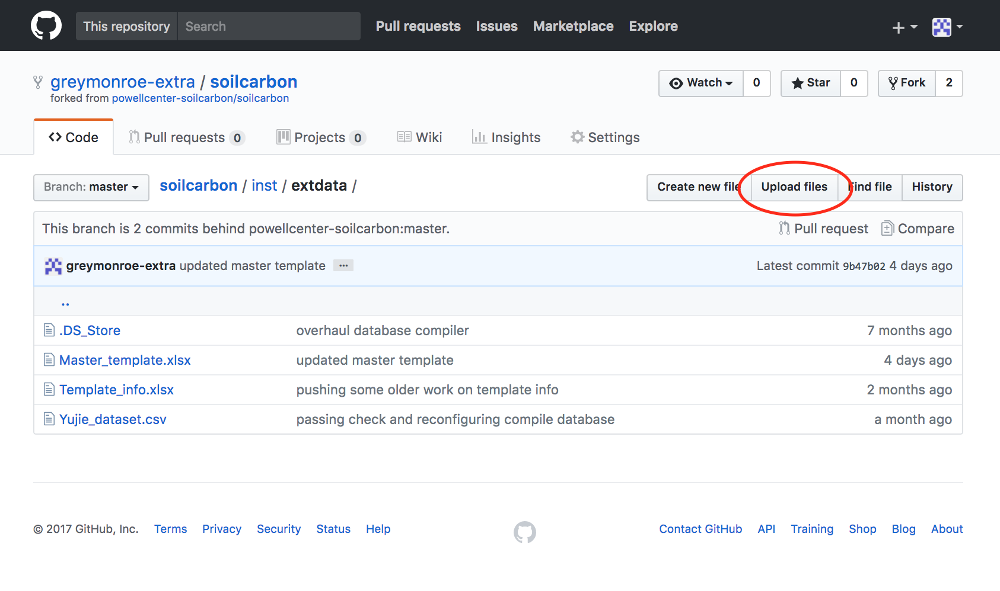
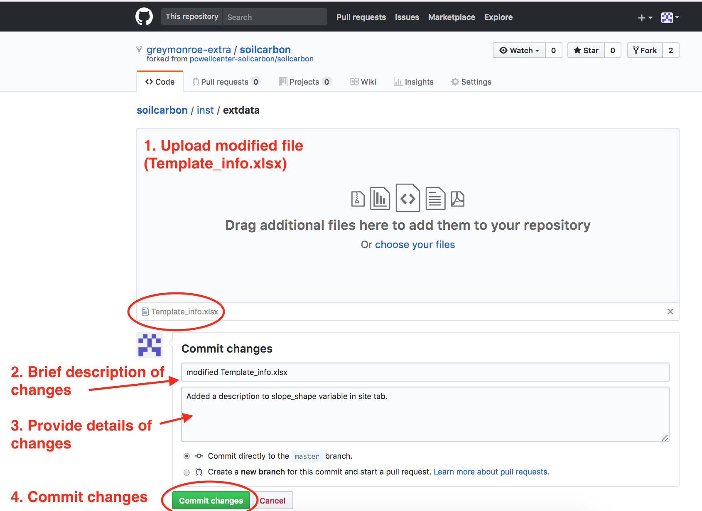
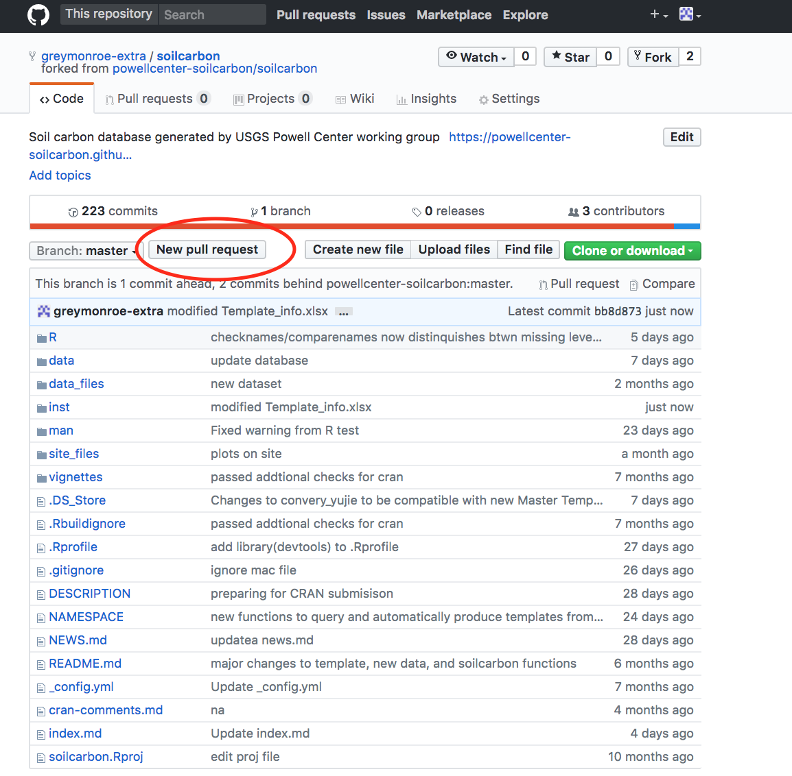
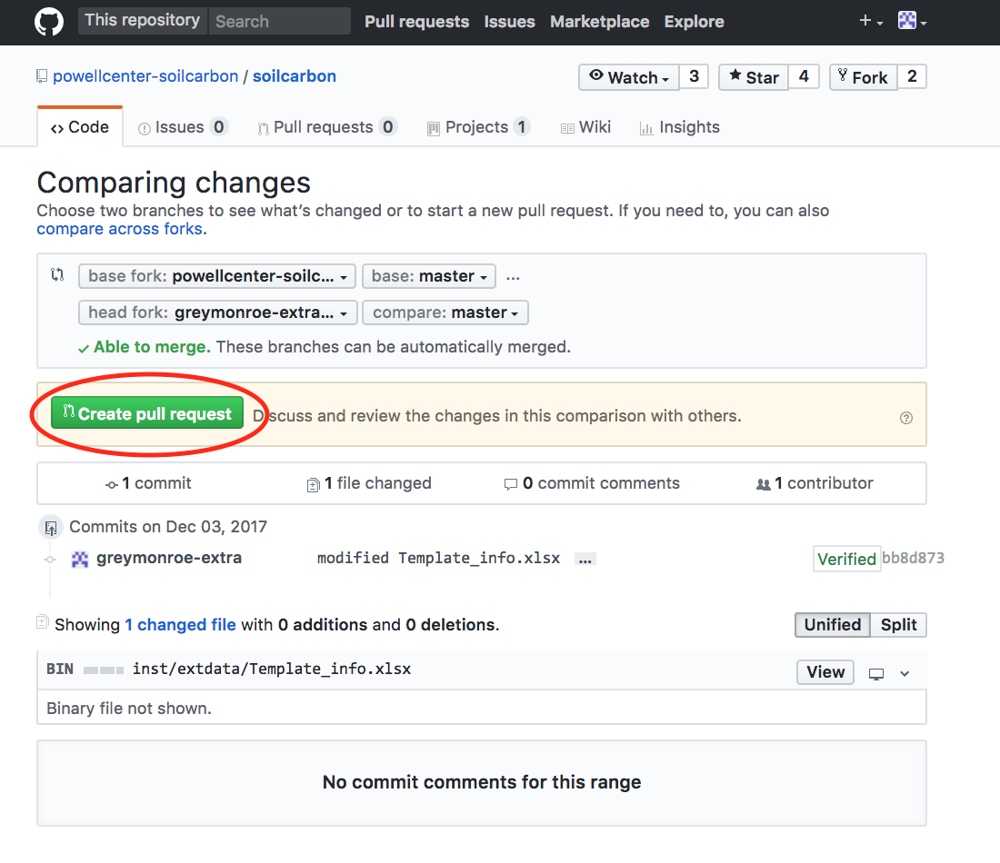
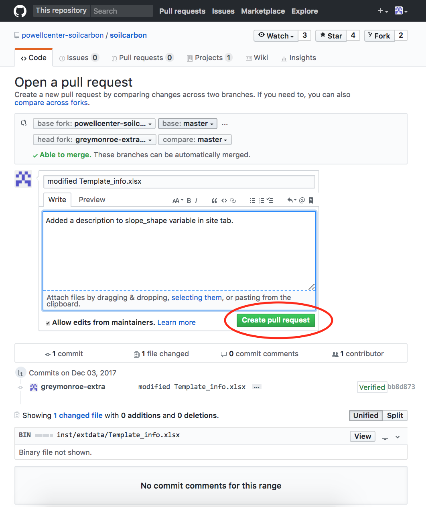
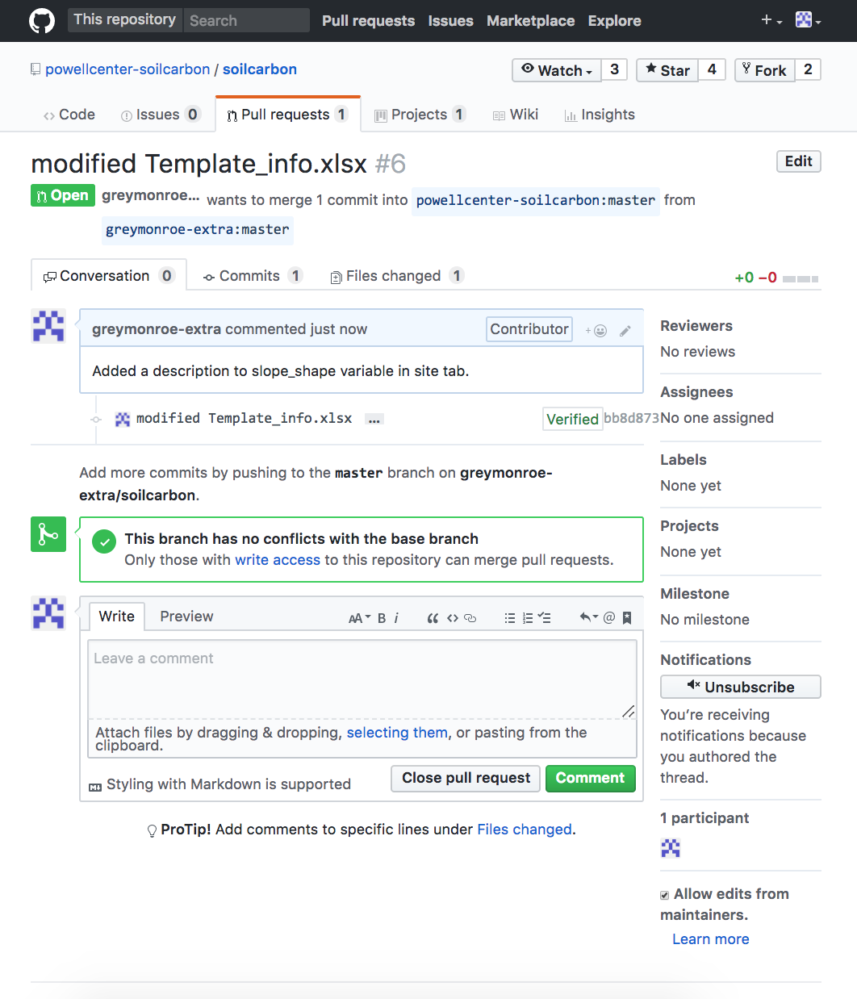

# contribute to soilcarbon package (making pull request)

Make github account.

go to:  https://github.com/powellcenter-soilcarbon/soilcarbon

This is a tutorial showing how to make a pull request. This is an example for making changes to the Template_info.xlsx file specifically.

Follow these steps:

# 1. 

# 2. 

# 3. 

# 4.

# 5.

# 6.

# 7.

# 8.

# 9.

# All done! The maintainers may accept your pull request or respond with questions. 
